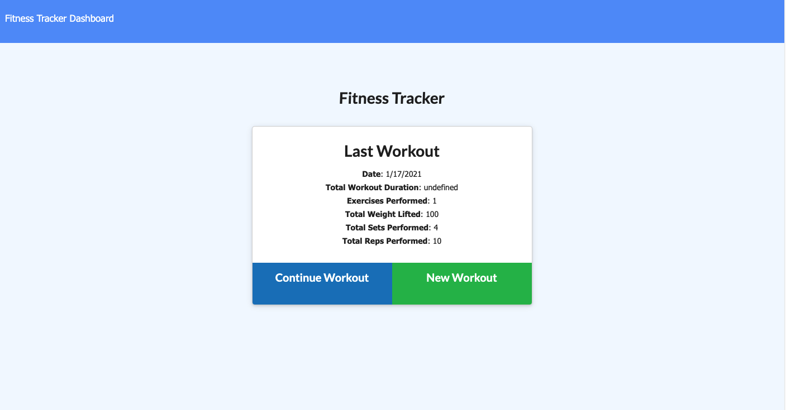

# Fitness-Tracker

Getting in shape is no easy feat. Let us help you! With the Fitness Tracker, you can enter data about the exercises you performed in a workout to keep track of how much you've squatted, run, pressed, and lifted. Nothing motivates a new gym goer more than seeing a summary of the activity they just performed. Science tells us that one change to implement when wanting to lead a healthier lifesyle is to get at least 30 minutes of activity per day. With the new Fitness Tracker application, you can track just that and more!

## Contents

* [Installation](#installation)
* [Usage](#usage)
* [License](#license)
* [Credits](#credits)

## Installation

If you would like to use the Fitness Tracker, please [click here](https://sheltered-lowlands-33096.herokuapp.com). If you would like to view the github repository for this application, please [click here](https://github.com/Aikeh2021/Fitness-Tracker).

## Usage

In order to use the website, create a New Workout. Choose an exercise type and then enter the details of the first exercise you complete during your workout. Once you have create the first exercise of your workout, you can continue the workout, making sure to add the details of each succeeding exercise performed. When you have completed the workout, you can navigate back to the home page to see details about your entire workout.

## License 

MIT License

Copyright (c) 2021 [Ashley Ikeh](https://github.com/Aikeh2021)

Permission is hereby granted, free of charge, to any person obtaining a copy
of this software and associated documentation files (the "Software"), to deal
in the Software without restriction, including without limitation the rights
to use, copy, modify, merge, publish, distribute, sublicense, and/or sell
copies of the Software, and to permit persons to whom the Software is
furnished to do so, subject to the following conditions:

The above copyright notice and this permission notice shall be included in all
copies or substantial portions of the Software.

THE SOFTWARE IS PROVIDED "AS IS", WITHOUT WARRANTY OF ANY KIND, EXPRESS OR
IMPLIED, INCLUDING BUT NOT LIMITED TO THE WARRANTIES OF MERCHANTABILITY,
FITNESS FOR A PARTICULAR PURPOSE AND NONINFRINGEMENT. IN NO EVENT SHALL THE
AUTHORS OR COPYRIGHT HOLDERS BE LIABLE FOR ANY CLAIM, DAMAGES OR OTHER
LIABILITY, WHETHER IN AN ACTION OF CONTRACT, TORT OR OTHERWISE, ARISING FROM,
OUT OF OR IN CONNECTION WITH THE SOFTWARE OR THE USE OR OTHER DEALINGS IN THE
SOFTWARE.
